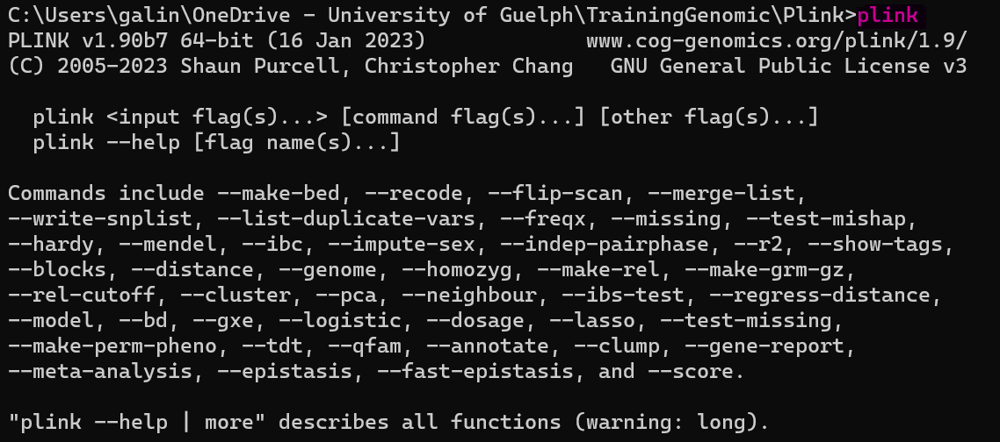
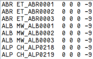
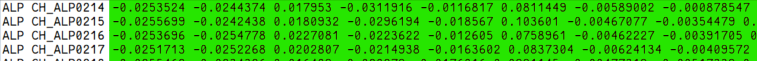

# Plink 1.9

#### 1.  Starting Plink

1.1  First, you must open the command prompt by typing cmd in Windows search.


1.2  Now you can change your directory by typing the **cd** and then the name of your directory. Note that in the command prompt, you don't need to use the backslash, type the directory's name.

```{bash eval=FALSE}
C:\Users\galin> cd OneDrive - University of Guelph
C:\Users\galin\OneDrive - University of Guelph> cd TrainingGenomic
C:\Users\galin\OneDrive - University of Guelph\TrainingGenomic> cd Plink
C:\Users\galin\OneDrive - University of Guelph\TrainingGenomic\Plink>plink
```

When you execute Plink with the last line of the code above, you will get the image below in your command prompt.



#### 2.  Open input files on Plink
2.1  The three basic files (*.bed*, *.fam*, *.bim*) need to be in the same directory that Plink;
2.2  Then use the following code:

```{bash eval=FALSE}
plink --bfile ADAPTmap_genotypeTOP_20160222_full --cow --freq --out freq_results
```

2.3  Lets brake down the code above:

<span style="color: blue;">\--bfile</span> is the command to binary files and will use the three files above if they have the same prefix

<span style="color: blue;">\--cow</span> set up the correct number of chromosomes for cow (29+xy), if you are working with different specie which has another chromosome number, you may need to use the argument
```{bash eval=FALSE}
--chr-set <autosome ct> ['no-x']['no-y']['no-xy']['no-mt']
```

<span style="color: blue;">\--out</span> specify the name of the output file

#### 3. Quality control on Plink

Using the code below you will perform a lot of quality control actions

```{bash eval=FALSE}
plink --bfile ADAPTmap_genotypeTOP_20160222_full --cow --maf 0.01 --geno 0.1 --mind 0.15 --chr 1-29 --make-bed --out final_output2
```

Lets brake down the code:

<span style="color: blue;">\--cow</span> informes the number of chromosomes

<span style="color: blue;">\--maf 0.01</span> filters out all variants with minor allele frequency below the provided threshold (default 0.01)

<span style="color: blue;">\--geno 0.1</span> filters out all variants with missing call rates exceeding the provided value (default 0.1) to be removed

<span style="color: blue;">\--mind 0.15</span> filters out all samples with missing call rates exceeding the provided value (default 0.1) to be removed

<span style="color: blue;">\--chr 1-29</span> excludes all variants not on the listed chromosome(s). In this particular case the sexual chromosomes are being excluded

<span style="color: blue;">\--make-bed</span> creates a new PLINK 1 binary fileset, after applying sample/variant filters and other operations

#### 4. Removing group / families of individuals

After performing some qulity control, you can remove group or family of individuals. Remember that in the *.fam* file (image below) the first column stand for the "group" or "family" while the second column represents the individual.



```{bash eval=FALSE}
plink --bfile final_output2 --cow --keep-fam indiv_keep.txt --make-bed --out final_output3
```
Lets brake down the code:

<span style="color: blue;">\--keep-fam</span> keep in the output file the groups of individuals that are present in the text file.

<span style="color: blue;">indiv_keep.txt</span> this text file contains the codes of families to be kept in the output file:
    
The code of groups or families (i.e. the first column in *.fam* file) that will be kept should be organized as a list in a text file, for example:
        
    ARG
    CCG
    ...
    SAA


#### 5. PCA analisys

5.1 Using the command <span style="color: blue;">\--pca</span> Plink will extract the top 20 principal components of the variance-standardized relationship matrix.
```{bash eval=FALSE}
plink --bfile final_output3 --cow --pca --out final_pca
```

- you can change the number by passing a numeric parameter
- Eigenvectors are written to *plink.eigenvec* file
- Top Eigenvalues are written to *plink.eigenval* file


5.2 With this outcomes you can plot a PCA PLOT using another software like R.


#### 6. Plotting a PCA on R.

6.1 Load the package ggplot2
```{r}
library(ggplot2)
```

6.2 You must to steer R for your work directory (i.e. the directory where you saved the file *plink.eigenvec*) using the command <span style="color: blue;">setwd()</span>
```{r eval=FALSE}
setwd("C:/Users/galin/OneDrive - University of Guelph/TrainingGenomic/Plink")
```


Your *.eigenvec* file looks like this:




The <span style="background-color: lightgreen; color: black;">green</span> area correspond to the top 20 principal components, while the first column is the "group/family" and the second column is the individual. In the image above, we are showing only 8 out of 20 principal components. 


6.3 You need creating one object named **pca_results** using the command *read.table* to read the file *plink.eigenvec* generated earlier by Plink

```{r message=FALSE, warning=FALSE}
pca_results <- read.table("final_pca.eigenvec", header = FALSE)
```

6.4 You need to attribute column names to this file, to do it, you will need to use the command *colnames*
```{r message=FALSE, warning=FALSE}
colnames(pca_results) <- c("Family", "Sample", paste0("PC", 1:20))
```

6.5 Now you will create a plot and store it in a object called **p**

- To create this plot you will use the <span style="color: blue;">ggplot</span> command

- **pca_results** is the object created in previous step

- <span style="color: blue;">aes</span> command set up some plot's aesthetics features

  <span style="color: blue;">x = PC1</span>: specify the variable to be mapped to the x-axis
  
  <span style="color: blue;">y = PC2</span>: specify the variable to be mapped to the y-axis
  
  <span style="color: blue;">x = color = Family</span>: you are attributing different colors for different values on column Family

- <span style="color: blue;">geom_point()</span>: is used to add individual points to a plot. It creates a scatter plot where each observation is represented by a point

- <span style="color: blue;">xlab("PCA1)</span>: the label of the x axis 

- <span style="color: blue;">ylab("PCA2)</span>: the label of the y axis 

- <span style="color: blue;">ggtitle("PCA Plot with Family Group Colors")</span>: The title of the plot

```{r echo=TRUE, message=FALSE, warning=FALSE}
p <- ggplot(pca_results, aes(x = PC1, y = PC2, color = Family)) +
  geom_point() +
  xlab("PC1") +
  ylab("PC2") +
  ggtitle("PCA Plot with Family Group Colors")
print(p)
```

6.6 Now you need to save your plot in a image file
```{r eval=FALSE}
ggsave("pca_plot.jpg", plot = p, width = 8, height = 6, dpi = 300)
```
- <span style="color: blue;">"pca_plot.jpg"</span>: the name of the output 

- <span style="color: blue;">plot=p</span>: is calling what to be stored, in this situation the object **p** previously created 

- <span style="color: blue;">width height dpi</span>: dimensions and resolution of your image.


#### 7. Admixture Analisys

7.1 A good option is using the function sNMF on LEA package

<http://membres-timc.imag.fr/Olivier.Francois/LEA/index.htm>

- LEA tutorial can be found in 
<http://membres-timc.imag.fr/Olivier.Francois/LEA/index.htm>

- To install LEA package first you need to install the Rtools 4.2 from 
<https://cran.r-project.org/bin/windows/Rtools/>

- After dowloading, execute the file in its directory. This is not a installation on R

- On R, load the package <span style="color: blue;">devtools</span>
```{r eval=FALSE}
library(devtools)
```

- Use the command below to install LEA
```{r eval=FALSE}
install_github("bcm-uga/LEA")
```

- Load the LEA package
```{r}
library(LEA)
```


7.2 The input file for LEA/sNMF is a *.geno* file. To get this file you must follow this steps:

- Get a *.ped* file from your bin files from Plink. In your command prompt type this command (make sure that your are in the correct directory where your binary files are)
```{bash eval=FALSE}
plink --bfile final_output3 --cow --recode --allow-no-sex --out genofile2
```

note that you are using as imput your file after quality control and individual removing.

- Now on R, using the package LEA you can convert the *.ped* file (created in the step above named "genofile2") to *.geno* file using the command below 
```{r eval=FALSE}
output = ped2geno("genofile2.ped", "genofile3.geno")
```
The command above will create the file "genofile3.geno" and disclose the above message with the number of individuals and loci.

7.3 Now it is time to run the sNMF on LEA. To performe this run the code below:
```{r eval=FALSE}
project = snmf("genofile3.geno",
               K = 9:13, 
               entropy = TRUE, 
               repetitions = 10,
               project = "new")
```
- The code above can last hours ou even days it depends of the numbers of repetitions, the numbers of K and you data dimentions.
- Don't change the project name, must be "new"
- As outcome you will create an objecte called "project"
- <span style="color: blue;">K = 1:10</span>: set up the range of possible K values
- <span style="color: blue;">entropy = TRUE</span>: ???????????????????
- <span style="color: blue;">repetitions = 10</span>: set up the number of repetitions per K value.

    **But lets take a look a little deeper in Cross-entropy**
    - Is based on prediction of masked genotypes to evalueate the quality of ancestry estimation.
    - This criterion will help to choose the number of ancestral population (K), or the best run among a set of runs.
    - A smaller value of cross-entropy criterion means a better run.
    

7.4 To find the most likely K value, you should Plotting cross-entropy criterion of all runs of the project. To make this run the code below:
```{r echo=FALSE}
#Use this option if your global environment file isn't stored in your local page
load("C:/Users/galin/OneDrive - University of Guelph/TrainingGenomic/TutorialAdmixtureAtPlink/GlobalEnvAdmix.RData")
```

```{r echo=FALSE}
#use this option if your global environment file is in your local page (work directory)
load("GlobalEnvAdmix.RData")
```

```{r}
plot(project, cex = 1.2, col = "blue", pch = 19)
```

Outcome: as you can see, the lower value is found when K =13. This is our K.

7.5 The next step is to display a barplot for the ancestry proportions, recorded in the Q-matrix.
- First we will select the best run (i.e. repetition) for K=10
```{r}
best = which.min(cross.entropy(project, K = 13))
```

- Second, lets set up our color scheme
```{r}
my.colors <- c("tomato", "lightblue",
               "olivedrab", "gold", "pink", "black",
               "magenta", "orange", "green", "blue",
               "yellow", "purple", "cyan")
```

- And now we are going to make the barplot
```{r}
barchart(project, K = 13, run = best,
         border = NA, space = 0,
         col = my.colors,
         xlab = "Individuals",
         ylab = "Ancestry proportions",
         main = "Ancestry matrix") -> bp
axis(1, at = 1:length(bp$order),
     labels = bp$order, las=1,
     cex.axis = .4)
```

        
        

